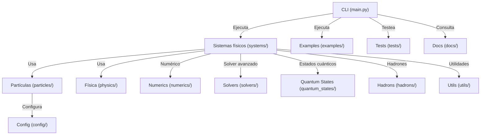

# Guía de Arquitectura y Módulos — Universe

## Estructura de carpetas principal

```
framework/universe/
├── universe/
│   ├── systems/           # Sistemas físicos acoplados (dinámica, acoplamientos)
│   ├── particles/         # Definiciones de partículas, grados de libertad, modelos de masa
│   ├── physics/           # Leyes físicas: nuclear, electromagnetismo, constantes
│   ├── numerics/          # Backend (NumPy/CuPy), operadores vectoriales, utilidades numéricas
│   ├── solvers/           # Solvers avanzados (Maxwell, FDTD, etc.)
│   ├── quantum_states/    # Estados cuánticos, wavefunctions, observables
│   ├── hadrons/           # Modelos de hadrones compuestos y nucleones
│   ├── config/            # Configuración global y parámetros de simulación
│   ├── utils/             # Utilidades generales y logging
│   └── main.py            # CLI principal y punto de entrada
├── examples/              # Scripts de simulación visual y de test
├── tests/                 # Tests automáticos de validación física y numérica
├── docs/                  # Documentación, bitácoras y criterios de desarrollo
```

## Propósito de cada módulo

- **systems/**: Integración de fuerzas, evolución temporal, sistemas acoplados (nuclear + electromagnético).
- **particles/**: Definición de partículas fundamentales y extendidas, grados de libertad (spin, isospin, carga, estado cuántico), modelos de masa.
- **physics/**: Implementación de leyes físicas (potenciales nucleares, Coulomb, Maxwell), constantes y conversiones de unidades.
- **numerics/**: Backend universal (NumPy/CuPy), operadores vectoriales, utilidades para cálculo eficiente en GPU/CPU.
- **solvers/**: Solvers avanzados para ecuaciones de Maxwell, FDTD, PML, etc.
- **quantum_states/**: Estados cuánticos, wavefunctions, observables y números cuánticos.
- **hadrons/**: Modelos de hadrones compuestos, nucleones y extensiones futuras.
- **config/**: Configuración global, parámetros de simulación y constantes de entorno.
- **utils/**: Utilidades generales, logging centralizado, helpers.
- **main.py**: CLI principal, entrada para simulaciones, tests y consultas.
- **examples/**: Scripts listos para ejecutar simulaciones visuales y de test.
- **tests/**: Suite de tests automáticos para validación física y numérica.
- **docs/**: Documentación, bitácoras, criterios de desarrollo y snapshots.

## Diagrama de arquitectura (Mermaid)



---

> Esta guía resume la arquitectura y dependencias principales del framework Universe para facilitar su extensión y mantenimiento.
